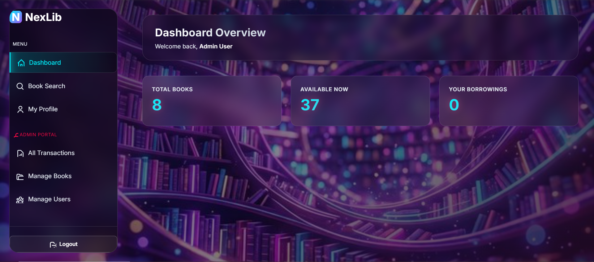
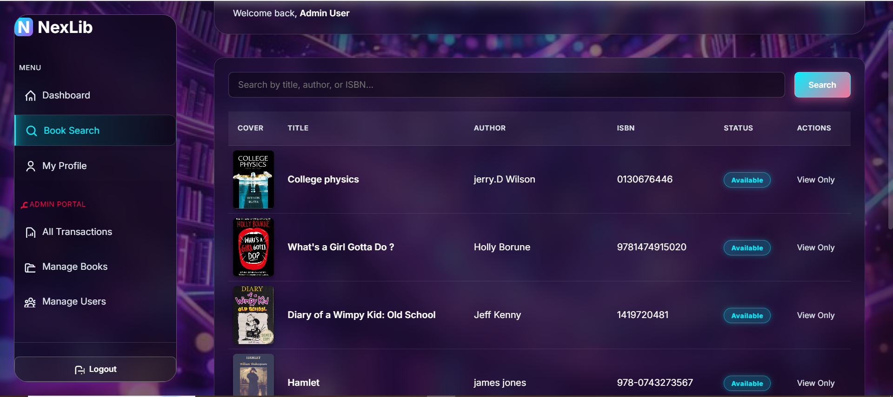

# NexLib — Library Management System

[](LICENSE) [](LICENSE) [](CHANGELOG.md)

NexLib is a production-grade, industry-level Library Management System — completed and released by Sudeepa Wanigarathna. It includes a robust PHP backend, a tested MySQL schema, JWT authentication, and a polished front-end for both users and administrators.


## Table of contents
- [Features](#features)
- [Tech stack](#tech-stack)
- [Project layout](#project-layout)
- [Prerequisites](#prerequisites)
- [Installation (quick)](#installation-quick)
- [Configuration](#configuration)
- [Database setup](#database-setup)
- [API reference](#api-reference)
- [Security & production checklist](#security--production-checklist)
- [Development & testing](#development--testing)
- [Contributing](#contributing)
- [License](#license)
- [Contact](#contact)

## Features
- User and admin authentication (JWT)
- Book catalog: create, read, update, delete
- Borrow and return workflow with transaction history
- Admin dashboard for managing books and users
- REST-style API under `api/` for integration with other apps

## 📸 Screenshots

Below are screenshots of the Library Management System.

<table align="center">
  <tr>
    <td align="center">
      <br>
      <b>📊 Dashboard</b>
    </td>
    <td align="center">
      <br>
      <b>📚 Manage Books</b>
    </td>
  </tr>
</table>

## Tech stack
- Frontend: HTML, CSS, Vanilla JavaScript (`assets/`)
- Backend: PHP (simple controller structure in `api/controllers`)
- Database: MySQL (schema in `sql/schema.sql`)
- Utilities: `utils/JWT.php`, `utils/Response.php`

## Project layout

- `index.html` — public user-facing UI
- `admin-auth.html` — admin login page
- `dashboard.html` — admin dashboard
- `api/` — API endpoints and controllers
	- `api/controllers/` — `AuthController.php`, `BookController.php`, `TransactionController.php`
	- `api/index.php` — central API router
- `api/config/` — configuration (database connection)
- `models/` — domain models (`Book.php`, `Transaction.php`, `User.php`)
- `utils/` — helpers (JWT, Response)
- `assets/` — static JS and CSS
- `sql/schema.sql` — DB schema and sample data

## Prerequisites
- PHP 7.4+ with `pdo_mysql` extension enabled
- MySQL or MariaDB
- Web server (Apache recommended for full routing; XAMPP or WAMP works on Windows)

## Installation (quick)
1. Copy the repository into your web root (e.g., `C:\xampp\htdocs\nexlib`).
2. Start Apache and MySQL (XAMPP control panel).
3. Create the database and import the schema (see next section).
4. Configure DB credentials in `api/config/db.php` or use environment variables (recommended).
5. Open `http://localhost/nexlib/index.html` to access the UI.

## Configuration
Edit `api/config/db.php` to set database connection values. For production, move credentials to environment variables instead of committing them to source.

Example configuration values I recommend (do not commit these):

```
DB_HOST=127.0.0.1
DB_NAME=library_db
DB_USER=root
DB_PASS=secret
JWT_SECRET=your_strong_secret_here
JWT_EXPIRE=3600
```

(If you want, I can add a `.env.example` and update `api/config/db.php` to read from environment variables.)

## Database setup
1. Create the database (phpMyAdmin or CLI):

```sql
CREATE DATABASE library_db CHARACTER SET utf8mb4 COLLATE utf8mb4_unicode_ci;
```

2. Import schema:

- phpMyAdmin: Select `library_db` → Import → choose `sql/schema.sql` → Go
- CLI: `mysql -u root -p library_db < sql/schema.sql`

3. Verify tables `users`, `books`, `transactions` exist after import.

## API reference
Base path: `/api/index.php` (routes are dispatched by `api/index.php`).

Authentication: get a JWT via `/login` and include it as `Authorization: Bearer <token>` for protected routes.

Endpoints (examples)
- `POST /api/index.php/login`
	- Body: `{ "email": "admin@example.com", "password": "password" }`
	- Response: `{ "success": true, "token": "<JWT>", "user": { ... } }`

- `GET /api/index.php/books`
	- Description: List books (public or protected depending on implementation)

- `POST /api/index.php/books`
	- Description: Create a new book (admin)
	- Body: `{ "title": "...", "author": "...", "isbn": "...", "copies": 3 }`

- `PUT /api/index.php/books/{id}`
	- Description: Update book details (admin)

- `DELETE /api/index.php/books/{id}`
	- Description: Remove a book (admin)

- `POST /api/index.php/borrow`
	- Body: `{ "book_id": 42 }`
	- Description: Borrow a book for the authenticated user

- `POST /api/index.php/return`
	- Body: `{ "transaction_id": 123 }`
	- Description: Return a borrowed book

Note: Inspect `api/controllers/` to confirm exact route names and parameters — adapt the examples above if your routing differs.

### Example: Login (curl)

```bash
curl -X POST "http://localhost/nexlib/api/index.php/login" \
	-H "Content-Type: application/json" \
	-d '{"email":"admin@example.com","password":"password"}'
```

### Example: Get books (curl)

```bash
curl "http://localhost/nexlib/api/index.php/books" \
	-H "Authorization: Bearer <JWT_TOKEN>"
```

## Security & production checklist
- Use HTTPS (TLS) for all traffic.
- Replace the default JWT secret with a strong secret and rotate periodically.
- Do not commit database credentials or secrets to source control; use environment variables.
- Validate and sanitize all inputs on the server.
- Implement rate limiting on authentication endpoints.
- Harden file and folder permissions on the server.

## Development & testing
- There are no automated tests included. I recommend adding PHPUnit tests for controllers and integration tests for the API.
- To run a quick local static server (for front-end-only testing):

```bash
php -S localhost:8000
# then open http://localhost:8000/index.html
```

## Contributing
I welcome contributions. Preferred workflow:
1. Open an issue describing the bug or enhancement.
2. Fork the repository and create a branch for your change.
3. Send a PR with a focused description and changelog entry.

I will review and provide feedback; please follow existing code style and keep commits small.

## License
This project is licensed under the MIT License. See `LICENSE` for details.

## Acknowledgements
- Built as a learning and demo project — inspired by common LMS patterns.

## Contact
Author: Sudeepa Wanigarathna

Status: Production (Completed)

Version: 1.0.0 — Release date: 2026-07-04


